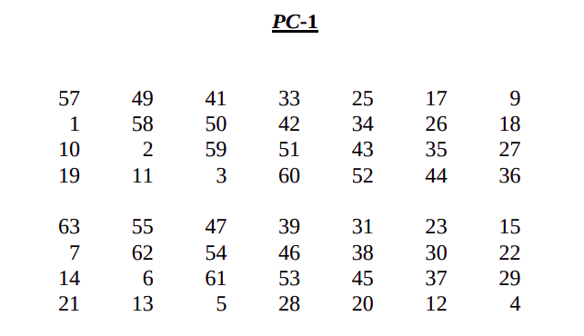
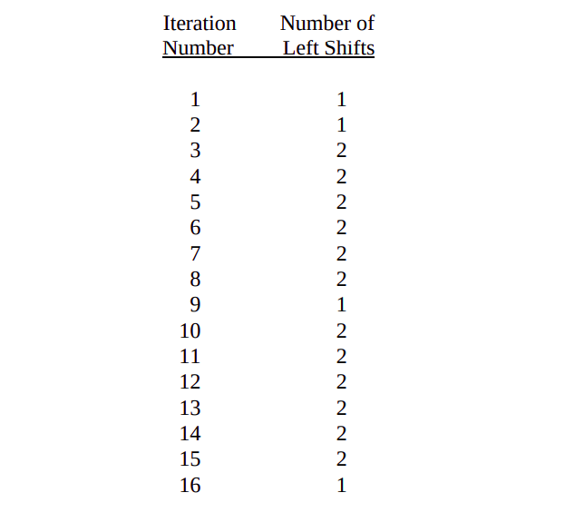
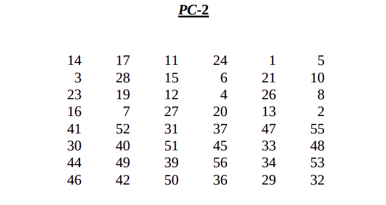

# Data Encryption Standard - DES

The Data Encryption Standard - DES is a block cipher designed to process (encipher and decipher) data in blocks of 64 bits and return processed data blocks of the same size. It uses a 64-bit key, however, only 56 bits are used (resulting in a key space of 2^56). 

# Structure of DES

<ol style="list-style: none">
    <!-- Stage 1 -->
    <li>
        <u style="font-size: 1.5em">1. Generating the 16 Subkeys</u>
        
The DES algorithm uses a 64-bit key however, only 56 bits are actually used. This happens because every 8th bit of the key is used for assuring that every byte is of odd parity. From this initial key K we must generate 16 subkeys Kn where 1 &#8804; n &#8804; 16.

        <ol style="list-style: none">
            <!-- Stage 1 Step 1 -->
            <li>
                <u style="font-size: 1.17em">1.1. Permuted Choice 1</u>
                
The initial key K is first permuted according to the following table.

                 
                
The permutation works as follows: the first bit of the permuted key PK is the 57th bit of the initial key K, the second bit of PK is the 49th bit of K and eventually the 56th (last) bit of PK is the 4th bit of K. Notice how the initial key K was 64 bits long but the permuted key is only 56 bits long? This is due to the fact that PC-1 ignores every 8th bit of K (the parity bit). The permuted key PK is then split up into two equal 28-bit halves referred to as C0 and D0.

            </li>
            <!-- Stage 1 Step 2 -->
            <li>
                <u style="font-size: 1.17em">1.2. The Key Schedule</u>
                
The two halves of the permuted key are used to generate another 16 pairs of halves. Each pair (Cn, Dn) is obtained from the previous pair (Cn-1, Dn-1) by applying a specific number of left shifts. This number is defined in the key schedule.

                 
                
The pair (C1, D1) is generated from the previous pair (C0, D0) such that (C1 = C0 << 1, D1 = D0 << 1). The pair (C4, D4) is obtained from the pair (C3, D3) by applying 2 left shifts (C4 = C3 << 2, D4 = D3 << 2). This way, we can generate all pairs if we know the key schedule and the permuted key PK.

            </li>
            <!-- Stage 1 Step 3 -->
            <li>
                <u style="font-size: 1.17em">1.3. Permuted Choice 2</u>
                
Each pair of halves is concatenated to obtain 16 56-bit keys CnDn. These keys are all permuted according to the following table.

                 
                
This permutation has the following effect: the first bit of Kn is the 14th bit of the pair CnDn, the second bit of Kn is the 17th bit of the pair CnDn and eventually the 48th (last) bit of Kn is the 32nd bit of the pair CnDn. Notice how the initial concatenated pairs are 56 bits long but the permuted keys are only 48 bits long? PC-2 ignores another 8 bits when generating the 16 subkeys. This step concludes the first stage of the DES algorithm, the generation of subkeys.

            </li>
        </ol>
    </li>
    <li>
        <u style="font-size: 1.5em">2. Encoding the Data Blocks</u>
    </li>
</ol>

